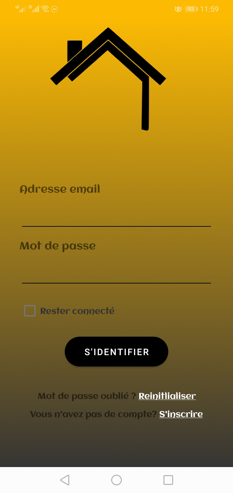
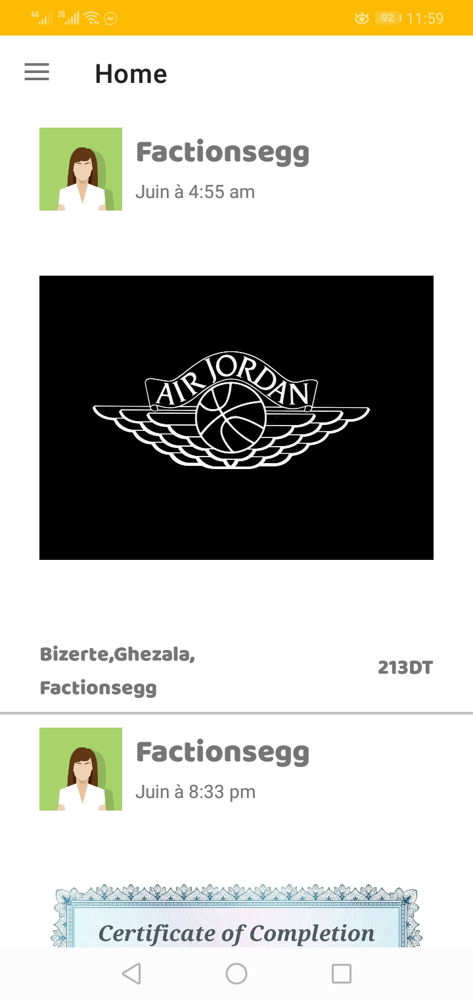
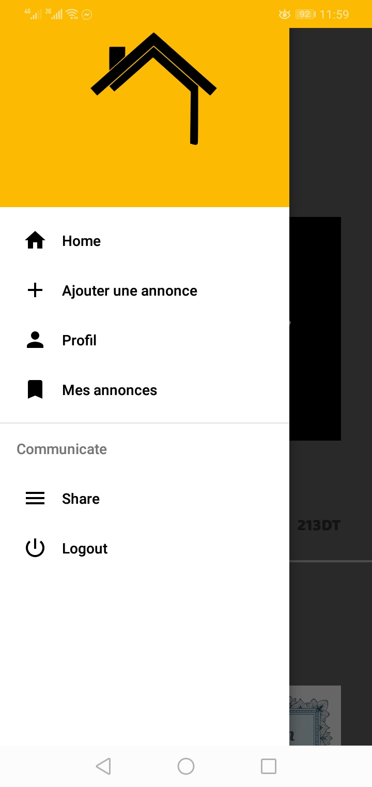
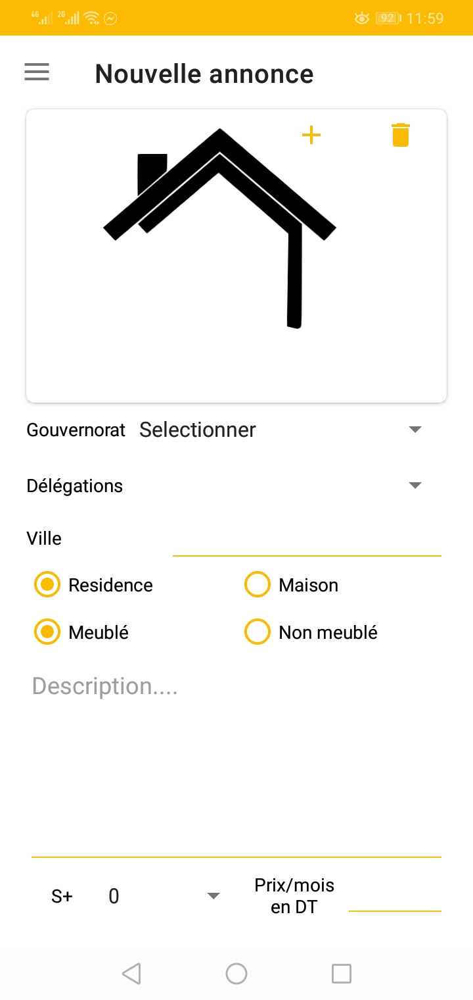

# Ekridar

## Description

Ekridar is an android app for renting houses its 90% done the project never seen the light because of low funding,  
for the backend i implemented backendless API

## Getting Started

### Dependencies

* Android Kitkat.

### Installing

* Clone the project
* Run/build the project on android studio and you are good to go

## Authors

Elouer mohammed akrem  

## License

This project is licensed under the GNU General Public License v3.0 - see the LICENSE.md file for details
## Pictures
    
  
  

